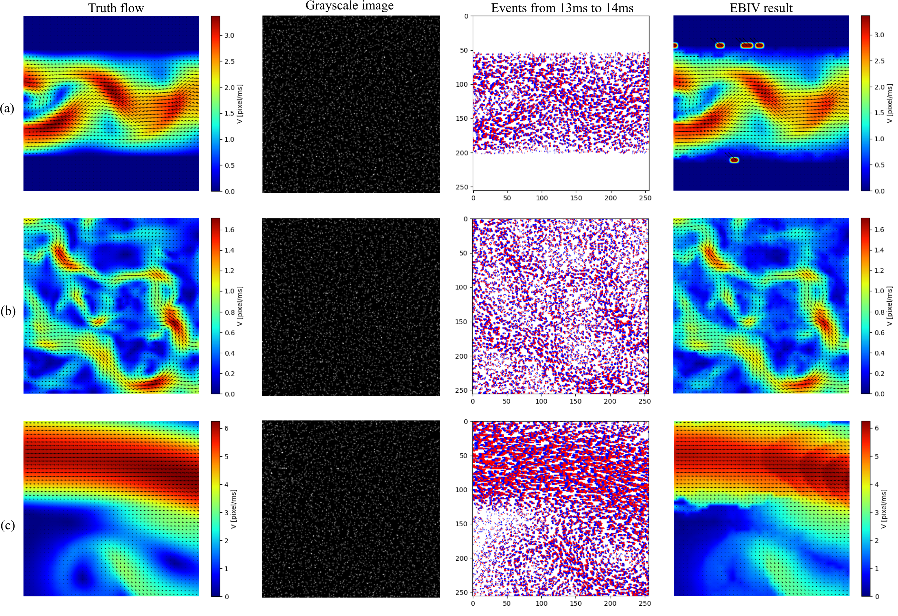

# FED-PV: A large scale synthetic frame/event dataset for particle-based velocimetry.

## Description

This is code accompanying the dataset ~~and paper~~ by Xiang Feng, Fan Wu and Aoyu Zhang.

Look forward to the upcoming release of our dataset.

## Dataset Presentation

The following are the three flow fields in our dataset, which are (a) Cylinder, (b) JHTDB, and (c) Backstep.


## Install

To be improved.

## Directory structure

```
main   
├─ flow_sets
│  └─ [flow field name]   
│     └─ *.flo 
├─ dataset   
│  └─ [flow field name]   
│     └─ *.png, *.h5   
├─ evt   
│  └─ [flow field name] 
│     └─ *.pnd, *.evt   
├─ utils   
│  ├─ class_dict.py  
│  ├─ plot.py  
│  ├─ progress_bar.py  
│  └─ smoothn.py  
├─ gen_event.py  
├─ gen_particle.py   
├─ main_dataset.py   
├─ README.md   
├─ read_flow.py 
└─ save_file.py   

```
